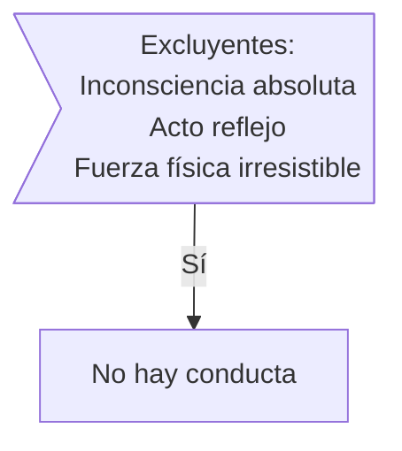
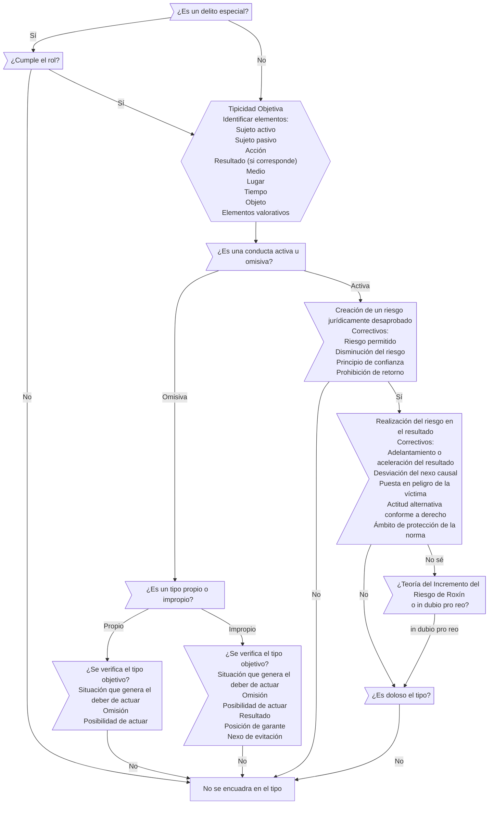
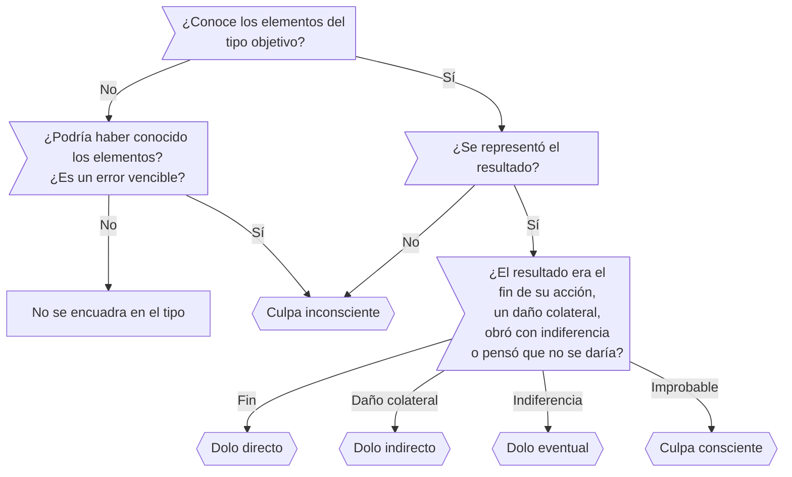

# Conducta

```mermaid
graph TD
    Excl>"Excluyentes:<br>Inconsciencia absoluta<br>Acto reflejo<br>Fuerza física irresistible"]
    Excl -->|Sí| nhc[No hay conducta]
```

# Tipicidad Objetiva

```mermaid
graph TD
    Especial>"¿Es un delito especial?"]
    Especial --> |Sí| EspecialOK>"¿Cumple el rol?"]
    Especial --> |No| TO
    EspecialOK --> |No| Atípica
    EspecialOK --> |Sí| TO{{"Tipicidad Objetiva<br>Identificar elementos:<br>Sujeto activo<br>Sujeto pasivo<br>Acción<br>Resultado (si corresponde)<br>Medio<br>Lugar<br>Tiempo<br>Objeto<br>Elementos valorativos"}}
    TO --> TOAuO>"¿Es una conducta activa u omisiva?"]
    TOAuO --> |Omisiva| PoI>"¿Es un tipo propio o impropio?"]
    PoI --> |Propio| OmisiónP>"¿Se verifica el tipo objetivo?<br>Situación que genera el deber de actuar<br>Omisión<br>Posibilidad de actuar"]
    OmisiónP --> |No| Atípica
    PoI --> |Impropio| OmisiónI>"¿Se verifica el tipo objetivo?<br>Situación que genera el deber de actuar<br>Omisión<br>Posibilidad de actuar<br>Resultado<br>Posición de garante<br>Nexo de evitación"]
    OmisiónI --> |No| Atípica
    TOAuO --> |Activa| CRJD>"Creación de un riesgo jurídicamente desaprobado<br>Correctivos:<br>Riesgo permitido<br>Disminución del riesgo<br>Principio de confianza<br>Prohibición de retorno"]
    CRJD -->|No| Atípica[No se encuadra en el tipo]
    CRJD -->|Sí| RRR>"Realización del riesgo en el resultado<br>Correctivos:<br>Adelantamiento o aceleración del resultado<br>Desviación del nexo causal<br>Puesta en peligro de la víctima<br>Actitud alternativa conforme a derecho<br>Ámbito de protección de la norma"]
    RRR --> |No| ND>"¿Es doloso el tipo?"]
    RRR --> |No sé| Depende>"¿Teoría del Incremento del Riesgo de Roxín<br> o in dubio pro reo?"]
    ND --> |"No"| Atípica
    Depende --> |"in dubio pro reo"| ND
```

# Tipicidad Subjetiva

```mermaid
graph TD
    Atípica[No se encuadra en el tipo]
    Cognitivo>"¿Conoce los elementos del tipo objetivo?"]
    Cognitivo --> |No| Vencible>"¿Podría haber conocido los elementos?<br>¿Es un error vencible?"]
    Vencible --> |No| Atípica
    Vencible --> |Sí| Inconsciente{{"Culpa inconsciente"}}
    Cognitivo --> |Sí| Volitivo>"¿Se representó el resultado?"]
    Volitivo --> |No| Inconsciente
    Volitivo --> |Sí| Fin>"¿El resultado era el<br>fin de su acción,<br>un daño colateral,<br>obró con indiferencia<br> o pensó que no se daría?"]
    Fin --> |Fin| DD{{"Dolo directo"}}
    Fin --> |Daño colateral| DC{{"Dolo indirecto"}}
    Fin --> |Indiferencia| DE{{"Dolo eventual"}}
    Fin --> |Improbable| Consciente{{"Culpa consciente"}}
```
